# Data Flow Diagrams

## DFD Level 0 - System Context

```mermaid
flowchart LR
    subgraph External["External Entities"]
        User["👤 YouTube Creator"]
        Google["🔵 Google/YouTube"]
        Stripe["💳 Stripe"]
        OpenAI["🤖 OpenAI"]
    end
    
    subgraph System["ChannelBoost System"]
        App["📱 ChannelBoost<br/>Application"]
    end
    
    User -->|"1. Auth + Actions"| App
    App -->|"2. Dashboard + Insights"| User
    
    App -->|"3. OAuth + API calls"| Google
    Google -->|"4. Tokens + Channel data"| App
    
    App -->|"5. Checkout + Webhooks"| Stripe
    Stripe -->|"6. Payment status"| App
    
    App -->|"7. Content prompts"| OpenAI
    OpenAI -->|"8. Generated ideas"| App
```

## DFD Level 1 - Major Data Flows

## DFD Level 1 - OAuth + YouTube Data Flow (Most Sensitive)

## DFD Level 1 - LLM Content Generation Flow

## Sensitive Data Never Crosses These Boundaries

| Data Type | Allowed Zones | Never Sent To |
|-----------|---------------|---------------|
| Passwords | DB (hashed only) | Logs, Client, APIs |
| OAuth Tokens | DB, Google | Logs, Client, OpenAI |
| Stripe Keys | Env vars, Stripe | Logs, Client, DB |
| User Email | DB, Resend | OpenAI, Logs (redacted) |
| JWT Secret | Env vars, NextAuth | Anywhere else |

## Data Deletion Flows

