# Trust Boundaries

This document defines all trust boundaries, components, and security zones in the ChannelBoost application.

## System Trust Boundary Diagram

```mermaid
flowchart TB
    subgraph UNTRUSTED["🔴 UNTRUSTED ZONE"]
        Browser["Browser Client<br/>(React SPA)"]
        Attacker["Potential Attacker"]
    end
    
    subgraph EDGE["🟡 EDGE ZONE (Vercel Edge)"]
        Middleware["middleware.ts<br/>Security Headers<br/>Request Validation"]
    end
    
    subgraph SERVERLESS["🟢 TRUSTED ZONE (Vercel Serverless)"]
        subgraph AUTH["Authentication Layer"]
            NextAuth["NextAuth.js<br/>JWT Sessions"]
            AuthMiddleware["withAuth()<br/>Authorization"]
        end
        
        subgraph API["API Layer"]
            Routes["API Routes<br/>/api/*"]
            Validation["withValidation()<br/>Zod Schemas"]
            RateLimit["withRateLimit()<br/>Rate Limiting"]
        end
        
        subgraph BIZ["Business Logic"]
            UserService["User Service"]
            ChannelService["Channel Service"]
            LLMService["LLM Service"]
        end
    end
    
    subgraph EXTERNAL["🔵 EXTERNAL SERVICES"]
        Google["Google OAuth<br/>YouTube APIs"]
        Stripe["Stripe<br/>Payments"]
        OpenAI["OpenAI<br/>GPT-4"]
        Resend["Resend<br/>Email"]
    end
    
    subgraph DATA["🟣 DATA ZONE"]
        PostgreSQL["PostgreSQL<br/>(Supabase/Neon)"]
    end
    
    Browser -->|"HTTPS + Cookies"| Middleware
    Attacker -.->|"Blocked by controls"| Middleware
    Middleware -->|"Headers applied"| Routes
    Routes --> NextAuth
    NextAuth --> AuthMiddleware
    AuthMiddleware --> Validation
    Validation --> RateLimit
    RateLimit --> BIZ
    BIZ -->|"Server-only calls"| Google
    BIZ -->|"Server-only calls"| Stripe
    BIZ -->|"Server-only calls"| OpenAI
    BIZ -->|"Server-only calls"| Resend
    BIZ -->|"Prisma ORM"| PostgreSQL
```

## Trust Zones Defined

### 🔴 Untrusted Zone
**Components**: Browser, any external client, potential attackers

**Security Stance**:
- All input is untrusted
- No secrets exposed
- No authorization decisions
- HTTPS only
- Cookies: HttpOnly, Secure, SameSite=Lax

### 🟡 Edge Zone (Vercel Edge Network)
**Components**: `proxy.ts`

**Responsibilities**:
- Apply security headers (CSP, HSTS, X-Frame-Options)
- Early request validation
- Request ID generation
- Geographic/routing decisions

**Trust Level**: Semi-trusted (limited execution, no DB access)

### 🟢 Trusted Zone (Serverless Functions)
**Components**: API routes, business logic, services

**Responsibilities**:
- All authentication decisions
- All authorization decisions
- All database access
- All external API calls
- Input validation
- Rate limiting

**Trust Level**: Fully trusted

### 🔵 External Services
**Components**: Google, Stripe, OpenAI, Resend

**Security Measures**:
- Server-side calls only (never from client)
- API keys in environment variables
- Webhook signature verification (Stripe)
- OAuth state validation (Google)

### 🟣 Data Zone
**Components**: PostgreSQL database

**Security Measures**:
- Connection via SSL
- No direct client access
- All queries via Prisma ORM (parameterized)
- Sensitive data encrypted/hashed

## JWT Token Flow

## JWT Configuration

| Property | Value | Justification |
|----------|-------|---------------|
| Storage | HttpOnly Cookie | Prevents XSS token theft |
| Secure flag | Yes (production) | HTTPS only |
| SameSite | Lax | CSRF protection while allowing OAuth redirects |
| Max Age | 30 days | Balance security/UX |
| Signing | HMAC-SHA256 | Industry standard |
| Secret | `NEXTAUTH_SECRET` | ≥32 bytes random |

## Data Retention

| Data Type | Retention | Deletion Behavior |
|-----------|-----------|-------------------|
| User account | Until deleted | Cascade delete all related data |
| Session tokens | 30 days | Auto-expire |
| OAuth tokens | Until revoked | Cascade on user delete |
| Analytics cache | 12-24h | Auto-expire |
| Plans cache | 24h | Auto-expire |
| Competitor data | 7 days | Auto-expire |

## External API Security

### Google OAuth
- State parameter: Random 192-bit, single-use, 10-min expiry
- Tokens: Never exposed to client, stored server-side
- Refresh: Automatic with rate limiting

### Stripe
- Webhook verification: HMAC-SHA256 with timing-safe comparison
- API calls: Server-side only
- Customer data: Referenced by ID, not stored

### OpenAI
- API key: Server-side only
- Rate limited: Per-user daily limits
- No PII sent to LLM
